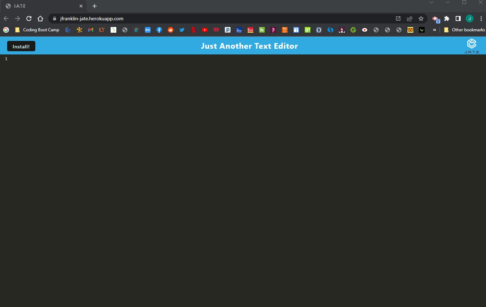
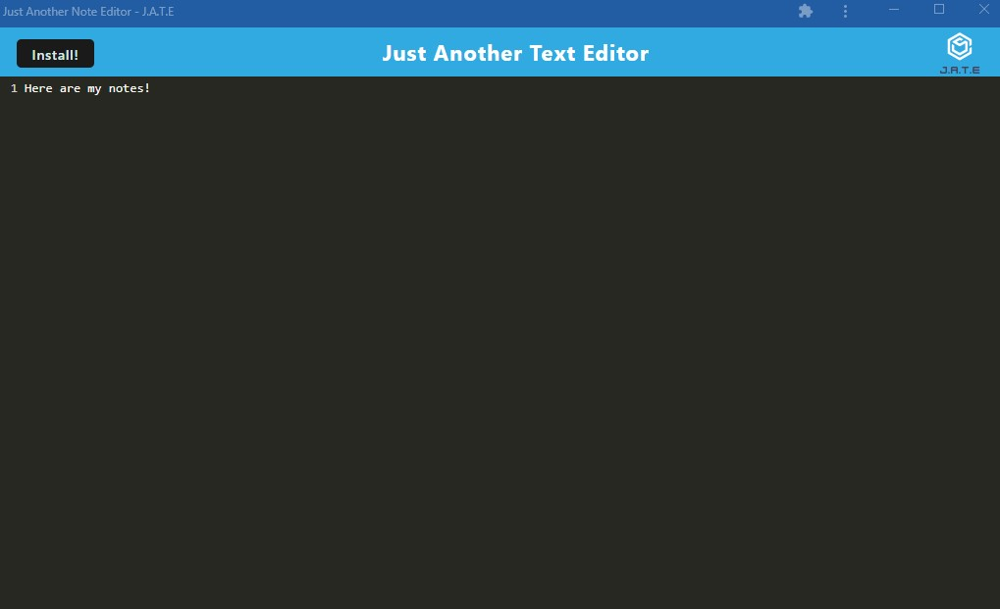
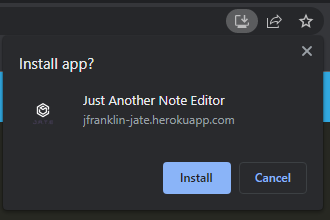

# Julian-Franklin-Progressive-Web-Applications-PWA-Text-Editor
   


  ## Description
  
  The Progress Web Application is a text editor that runs in your browser, and also functions offline. This is a single-page application that allows users to save their notes. When the user clicks on the install button, a pop-up will appear where the user can click install to open the application.

  
  
  

  [J.A.T.E Website](https://jfranklin-jate.herokuapp.com/)

  ## Table of Content
  - [Installation](#installation)
  - [Usage](#usage)
  - [Contributing](#contributing)
  - [Tests](#tests)
  - [Questions](#questions)
  - [License](#license)

  ## Installation

  To install, run ```npm i``` and then ```npm run build``` in the command line. 

  ## Usage

  Once dependencis and databse have been installed, run ```npm start:dev``` in the terminal to start the sever.

  ## Contributing

  This application is not currently accepting applications.

  ## Tests
  
  There are no tests for this project.

  ## Questions

  If you have any questions, contact me at j.franks725@gmail.com. Visit my GitHub page at [jfranklin12](https://github.com/jfranklin12/) to see my other projects.

  ## Liscence
    
  This projected is licensed under MIT.

  https://opensource.org/licenses/MIT


